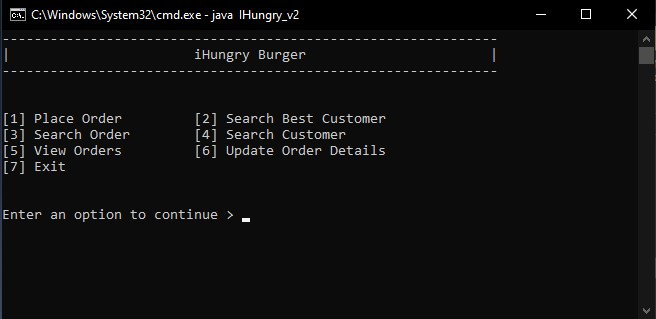

# 🍔 IHungry_v2

Welcome to **IHungry_v2**! 🚀

A modern, Java-based burger shop management system designed to make your business sizzle! Whether you're flipping patties or tracking inventory, IHungry_v2 has you covered with a clean interface and robust features.

---

## 🎯 Features

- 📝 **Order Management** – Fast and easy order processing
- 📦 **Inventory Tracking** – Real-time stock updates
- 👥 **Customer Management** – Keep your customers happy
- 💻 **Intuitive UI** – Simple, professional, and easy to use
- 🔧 **Extensible Codebase** – Built for future growth
- 📊 **Sales Reports** – Track your shop’s performance
- 🛠️ **Error Handling** – Reliable and secure

---

## 🛠️ Getting Started

### 📋 Prerequisites
- Java Development Kit (JDK) 8 or higher
- IDE: IntelliJ IDEA, Eclipse, or VS Code

### ⚡ Installation
1. Clone the repository:
   ```powershell
   git clone https://github.com/codewitharavinda/Burger-Shop-v2.git
   ```
2. Open the project in your IDE.
3. Build and run `IHungry_v2.java`.

---

## 🚀 Usage

1. Launch the application.
2. Log in or create a new user profile.
3. Start managing orders, inventory, and customers.
4. View sales reports and analytics.

### 🖥️ Screenshots

Below is a screenshot of the application interface:



_For more screenshots, see the `screenshots` folder in this repository._

---

## 🤝 Contributing

We love your ideas! 💡
- Fork the repo
- Create your feature branch (`git checkout -b feature/AmazingFeature`)
- Commit your changes (`git commit -m 'Add some AmazingFeature'`)
- Push to the branch (`git push origin feature/AmazingFeature`)
- Open a pull request

---

## 📄 License

This project is licensed under the MIT License. See the [LICENSE](LICENSE) file for details.

---

## 👤 Author

Developed by [codewitharavinda](https://github.com/codewitharavinda).

---

## 📬 Contact & Support

- For issues, suggestions, or feature requests, open an issue on the [GitHub repository](https://github.com/codewitharavinda/Burger-Shop-v2).
- Email: _supunaravinda2004@gmail.com_

---

## 🌟 Acknowledgements

- Thanks to all contributors and users!
- Inspired by burger lovers everywhere 🍟🍔🥤
